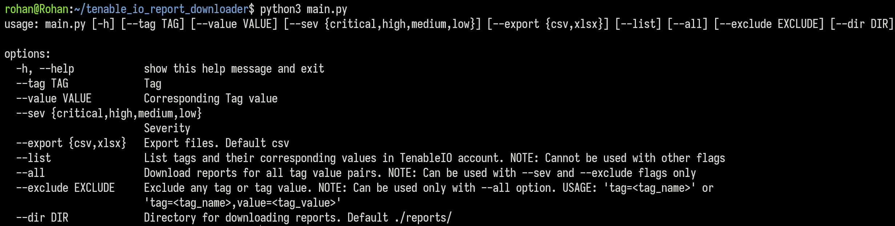

# Tenable IO report downloader

## Description

The intent behind this project is to download Tenable IO Vulnerability reports without exporting each report manually from Tenable IO findings page. 
- Currently only below headers are captured in the downloaded report:
	- `asset details  = agent_uuid, hostname, ipv4, operating_system`
	- `plugin details  = description, cve, id, name, solution, synopsis, see_also, exploit_available, has_patch`
	- `detected details  = first_found, last_found`
- To add/remove any other header you can edit the `src/get_vulns.py` file accordingly. 
- Only active/open vulnerabilities are captured in the report. 
- Vulnerabilities that have recasted/accepted state are not captured in the report.

## Installation

- Generate API keys from Tenable IO and add them in `src/.env` file.
- Clone the repository: `git clone https://github.com/Mrd0zz/tenable-report-downloader.git`
- Install required python3 modules: `pip3 install -r requirements.txt`

## Usage

- List tags and corresponding tag values
	- `python3 main.py --list`

- Simple report download for any tag:value
	- `python3 main.py --tag <TAG_NAME> --value <TAG_VALUE> --sev critical` 

- Export report in slxs format
	- `python3 main.py --tag <TAG_NAME> --value <TAG_VALUE> --sev critical --export xlsx`

- Specify download directory for the reports
	- `python3 main.py --tag <TAG_NAME> --value <TAG_VALUE> --sev critical --dir directory_name`

- Download report for all tag:value pairs 
	- `python3 main.py --all`

- Exclude any tag:value or a single tag  
	- `python3 main.py --all --exclude 'tag=<TAG_NAME>, value=<TAG_VALUE>'`
	- `python3 main.py --all --exclude 'tag=<TAG_NAME>'` 